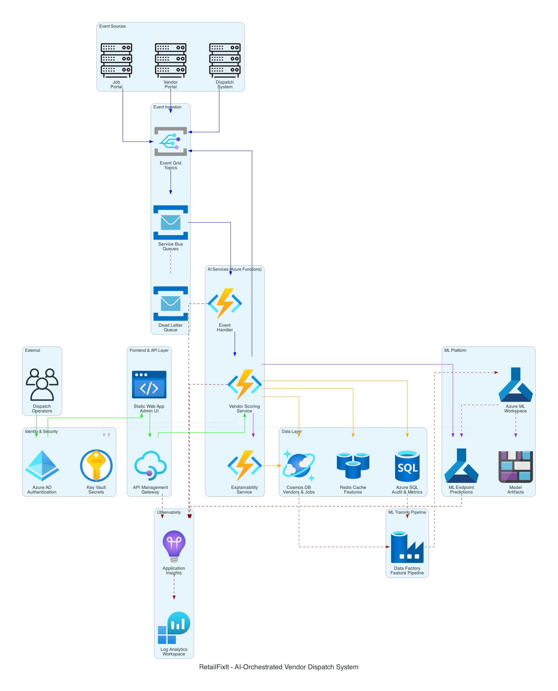
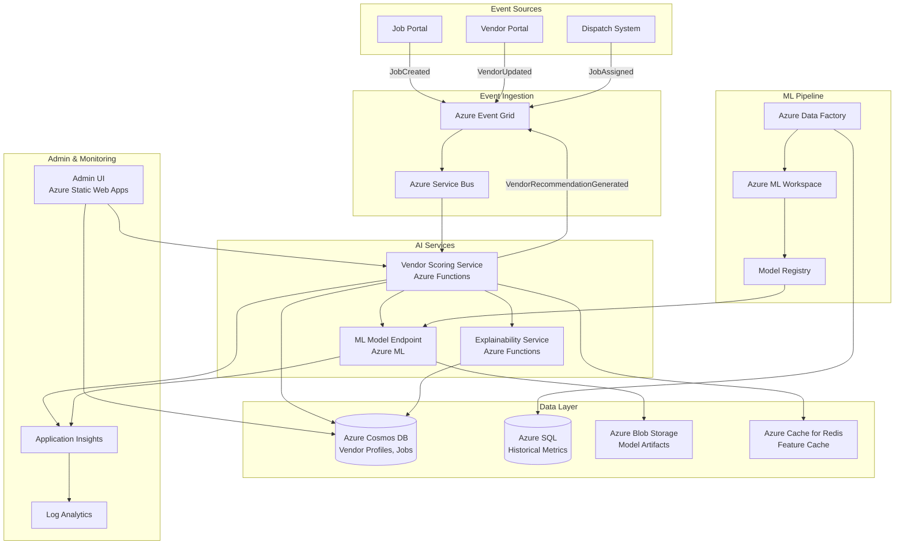
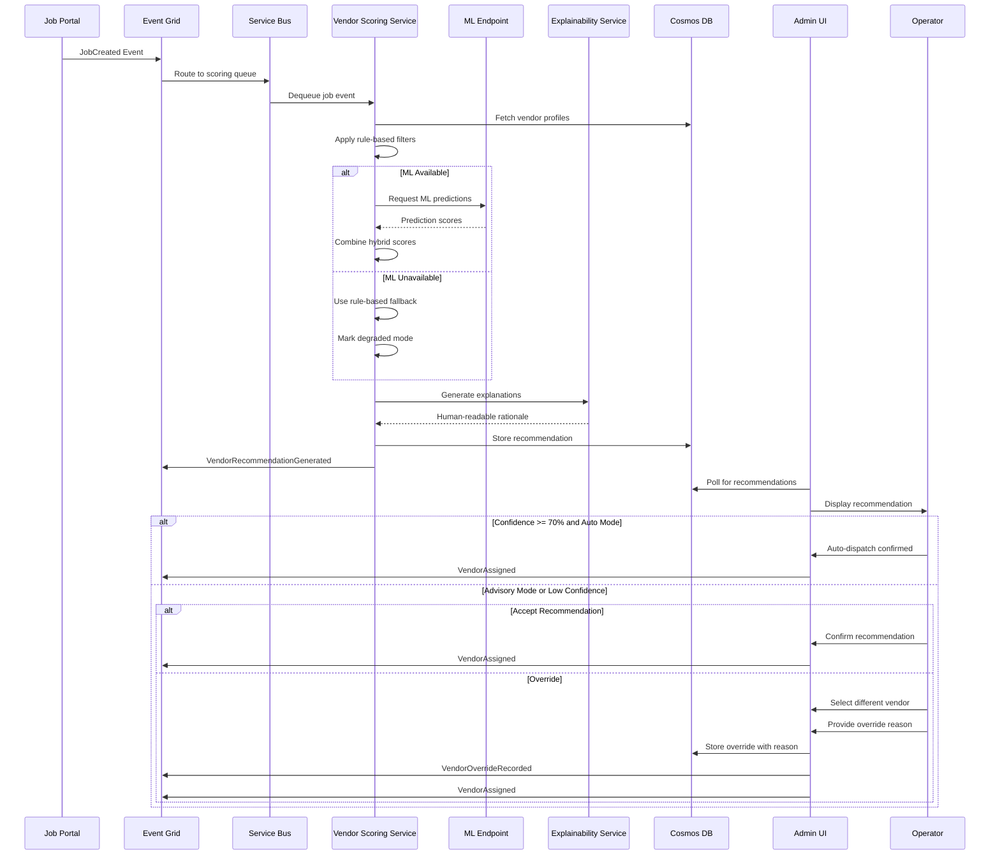
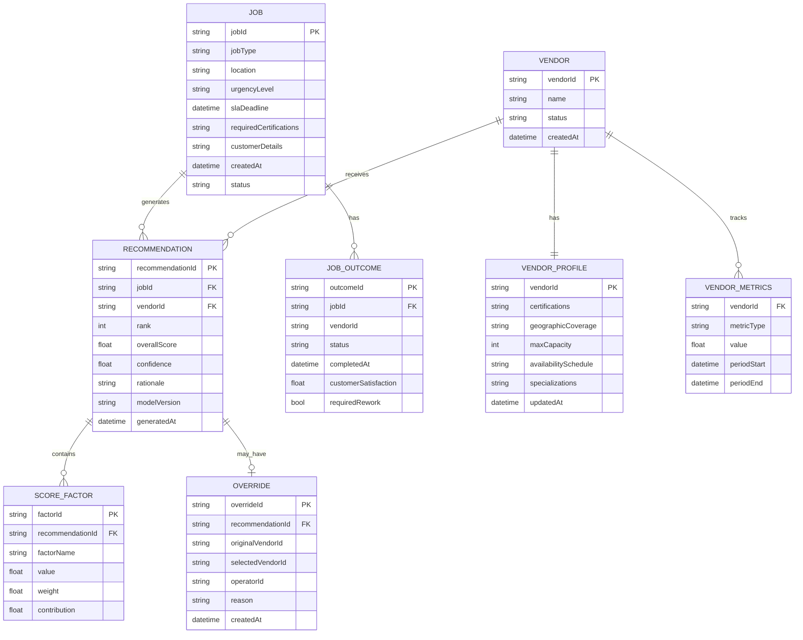
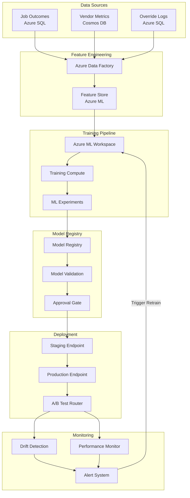
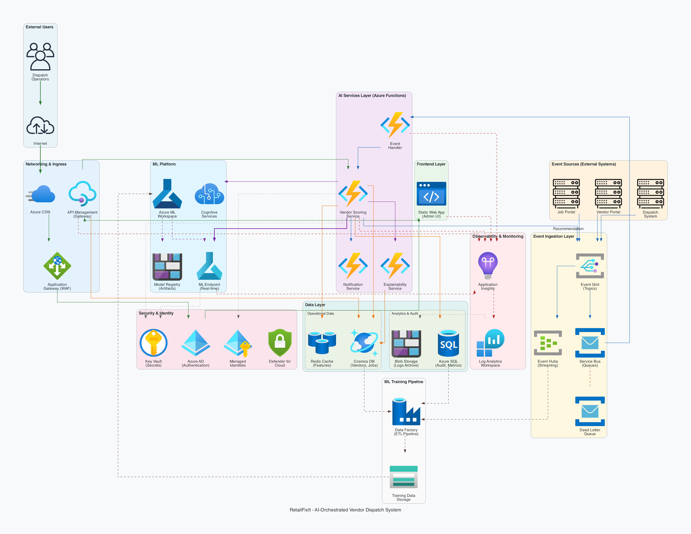

# Architecture Diagrams

This directory contains architecture diagrams for the RetailFixIt Vendor Dispatch System.

## High-Level Azure Architecture

### Architecture Overview

The diagram above shows the complete Azure architecture for the RetailFixIt AI-Orchestrated Vendor Dispatch System. The system is organized into logical layers that handle different responsibilities.

### Component Layers

**External**
- **Dispatch Operators**: Human users who review recommendations and can override AI decisions
- **Event Sources**: Upstream systems (Job Portal, Vendor Portal, Dispatch System) that publish events when jobs are created or updated

**Security & Identity**
- **Azure AD**: Handles authentication for all users accessing the Admin UI
- **Key Vault**: Securely stores connection strings, API keys, and other secrets

**Frontend**
- **Static Web App**: Hosts the Admin UI where operators view recommendations and perform overrides

**Event Ingestion**
- **Event Grid**: Receives events from all sources and routes them to appropriate handlers
- **Service Bus**: Provides reliable message queuing with guaranteed delivery
- **Dead Letter Queue**: Captures failed messages for investigation and replay

**AI Services (Azure Functions)**
- **Event Handler**: Processes incoming events from Service Bus
- **Vendor Scoring Service**: Core AI service that calculates hybrid scores combining rules and ML predictions
- **Explainability Service**: Generates human-readable explanations for each recommendation

**ML Platform**
- **Azure ML Workspace**: Manages model training, experiments, and versioning
- **ML Endpoint**: Serves real-time predictions for completion probability, time-to-complete, and rework risk
- **Model Artifacts**: Blob storage for trained model files and versions

**Data Layer**
- **Cosmos DB**: Low-latency storage for vendor profiles, jobs, and recommendations
- **Redis Cache**: Caches frequently accessed features to reduce database load
- **Azure SQL**: Relational storage for audit logs, historical metrics, and ML training data

**Observability**
- **Application Insights**: Collects telemetry, traces, and custom metrics from all services
- **Log Analytics**: Centralized log aggregation for querying and alerting

### Connection Legend

| Color | Flow Type | Description |
|-------|-----------|-------------|
| 🟢 Green | User/Auth | Operator authentication and UI interactions |
| 🔵 Blue | Events | Event publishing and processing flow |
| 🟣 Purple | AI/ML | Prediction requests and model deployment |
| 🟠 Orange | Data | Database read/write operations |
| ⚫ Gray (dotted) | Security | Secrets retrieval from Key Vault |
| 🔴 Red (dashed) | Monitoring | Telemetry and logging |

---

## System Overview (Mermaid)

### Key Components

| Component | Azure Service | Purpose |
|-----------|--------------|---------|
| Event Ingestion | Event Grid + Service Bus | Reliable event routing with dead-letter support |
| Scoring Service | Azure Functions | Serverless vendor scoring with auto-scaling |
| ML Endpoint | Azure ML | Managed model hosting with versioning |
| Data Store | Cosmos DB | Low-latency vendor profile storage |
| Audit Store | Azure SQL | Relational storage for compliance |
| Cache | Redis | Feature caching for performance |
| Admin UI | Static Web Apps | Operator interface with Azure AD auth |

---

## Event Flow Diagram

This sequence diagram shows the complete flow from job creation to vendor assignment.

### Event Types

| Event | Publisher | Subscriber | Purpose |
|-------|-----------|------------|---------|
| JobCreated | Job Portal | Scoring Service | Triggers vendor scoring |
| VendorRecommendationGenerated | Scoring Service | Admin UI | Delivers ranked vendors |
| VendorOverrideRecorded | Admin UI | ML Pipeline | Captures feedback for retraining |
| VendorAssigned | Admin UI | Dispatch System | Confirms final assignment |

---

## Data Model Diagram

This entity-relationship diagram shows the core data structures and their relationships.

### Storage Distribution

| Entity | Storage | Partition Key | Rationale |
|--------|---------|---------------|-----------|
| Job | Cosmos DB | serviceRegion | Query by region for scoring |
| Vendor Profile | Cosmos DB | serviceRegion | Co-locate with jobs |
| Recommendation | Cosmos DB | jobId | Query by job |
| Override | Azure SQL | - | Relational queries for audit |
| Job Outcome | Azure SQL | - | ML training joins |
| Vendor Metrics | Azure SQL | - | Aggregation queries |

---

## ML Pipeline Diagram

This diagram shows the machine learning lifecycle from data collection to model deployment.

### ML Pipeline Stages

| Stage | Component | Trigger | Output |
|-------|-----------|---------|--------|
| Data Collection | Data Factory | Daily schedule | Feature dataset |
| Training | ML Workspace | Weekly or drift alert | Model candidate |
| Validation | Model Registry | New model registered | Validation metrics |
| Deployment | Blue-Green | Manual approval | Production endpoint |
| Monitoring | Drift Detector | Continuous | Alerts if drift >threshold |

### Model Predictions

The ML model produces three predictions for each vendor-job pair:

1. **Completion Probability** (0-1): Likelihood vendor completes job successfully
2. **Time-to-Completion** (hours): Predicted duration to complete job
3. **Rework Risk** (0-1): Probability of requiring rework

### Feedback Loop

Override data flows back into training:
1. Operator overrides AI recommendation
2. Override logged with reason to Azure SQL
3. Data Factory includes overrides in next training batch
4. Model learns from human expertise

---

## Future Architecture (Production-Ready)

The diagram below shows the enhanced architecture with additional Azure services for a production-grade deployment.

### Additional Components

| Service | Purpose |
|---------|---------|
| **Azure CDN** | Global edge caching for Admin UI |
| **Application Gateway (WAF)** | Web application firewall, SSL termination, DDoS protection |
| **API Management** | Rate limiting, API versioning, developer portal |
| **Event Hubs** | High-volume event streaming for ML pipelines |
| **Managed Identities** | Zero-secret authentication between services |
| **Defender for Cloud** | Security monitoring and compliance |
| **Cognitive Services** | Text analytics, anomaly detection |
| **Data Factory** | ETL pipelines for ML training data |

See [tradeoffs-assumptions.md](../tradeoffs-assumptions.md#production-ready-enhancements) for rationale.
